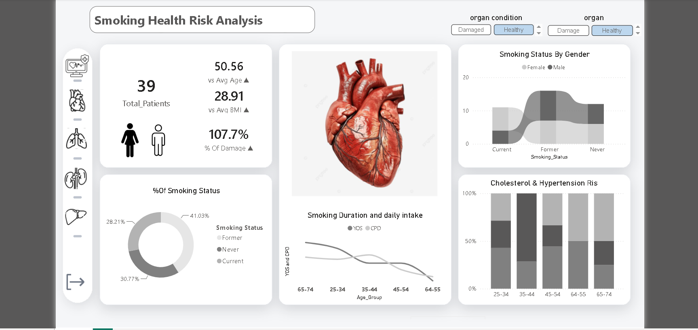
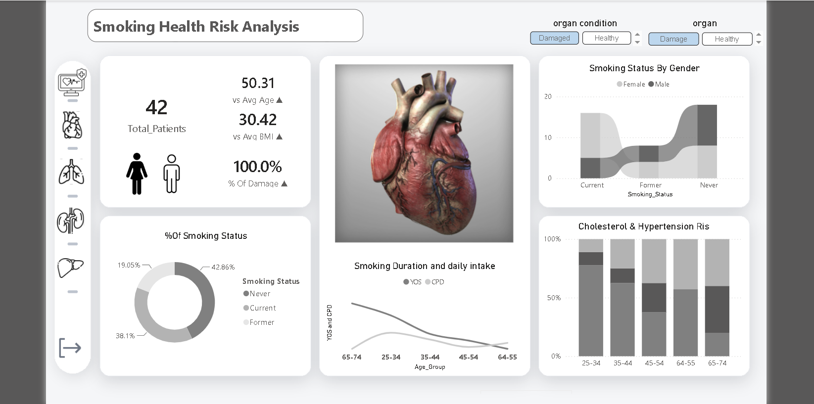
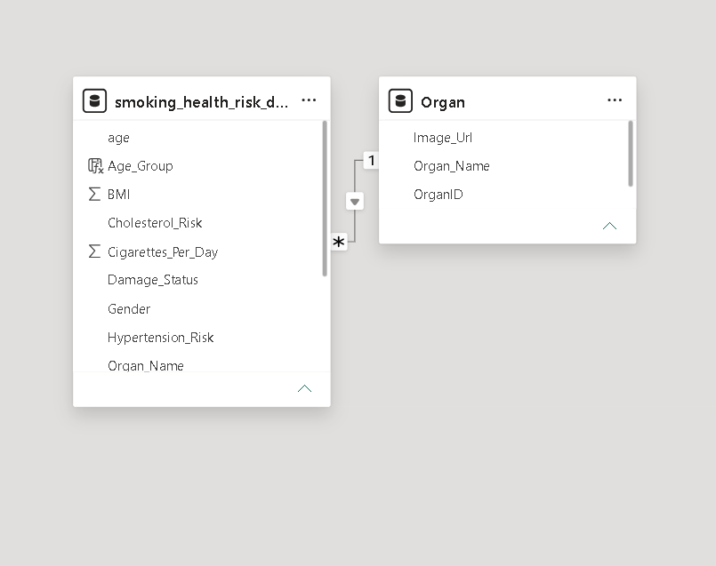

# 🚭 Smoking Health Impact - Interactive Power BI Dashboard

An advanced, interactive Power BI dashboard designed to raise health awareness by visualizing the devastating physiological impacts of smoking on vital human organs. The report dynamically compares health metrics, smoking statuses, and risks across different age groups and organ conditions.

---

## 🖼️ Dashboard Preview

### 1. Main Dashboard View


### 2. Data Model Architecture


---

## 🌟 Key Features & Dashboard Overview

- **Multi-Organ Navigation:** Features an interactive sidebar allowing users to seamlessly switch between different organs (e.g., Heart, Lungs, Kidneys, Liver) with dedicated visual representations.
- **Dynamic Organ Condition & Organ Slicers:** Slicers at the top right let users filter by **organ condition** (*Damaged* vs. *Healthy*) and specific *organs*.
- **Comparative Visual State (Healthy vs. Damaged):** 
  - The dashboard dynamically displays the anatomical image of the selected organ transitioning from its **Healthy** state to a **Damaged** state due to smoking.
  - Instantly updates the associated medical charts, metrics, and risk indicators based on the chosen condition.
- **Age-Group & Behavioral Insights:** 
  - Integrates **`Age_Group`** breakdowns to analyze how smoking duration (**YOS** - Years of Smoking) and daily cigarette intake (**CPD** - Cigarettes Per Day) evolve across different age brackets.
  - Correlates organ damage and health risks directly with patient age distributions.
- **Key Performance Indicators (KPI Cards):** Displays total patients (`39`), average age comparison (`50.56 vs Avg Age`), average BMI (`28.91`), and percentage of damage (`107.7%`).
- **Demographic & Risk Charts:**
  - **Smoking Status by Gender:** Area chart tracking distribution across *Current*, *Former*, and *Never* smokers.
  - **% of Smoking Status:** Donut chart breaking down patient ratios by smoking habits.
  - **Smoking Duration and Daily Intake:** Line charts mapping YOS and CPD across various age groups.
  - **Cholesterol & Hypertension Risk:** Stacked column charts showing risk distributions across age groups.

---

## 🗄️ Data Model Architecture

The data model follows a clean Star Schema relationship:
- **`Organ` (Dimension Table):** Contains master data for organs and image links.
  - Fields: `OrganID`, `Organ_Name`, `Image_Url`
- **`smoking_health_risk_data` (Fact Table):** Contains patient-level metrics, health indicators, and habits linked via a **One-to-Many (1 to *)** relationship on `Organ_Name`.
  - Fields: `age`, `Age_Group`, `BMI`, `Cholesterol_Risk`, `Cigarettes_Per_Day`, `Damage_Status`, `Gender`, `Hypertension_Risk`, `Organ_Name`

---

## 🛠️ Tech Stack & Tools

- **Microsoft Power BI Desktop**
- **Data Modeling & Relationships**
- **DAX (Data Analysis Expressions)** for calculated measures and dynamic indicators.
- **Custom Visuals:** 
  - HTML Content
  - Advanced Card

---

## 📂 Repository Structure

```text
├── images/                             # Folder containing dashboard and data model screenshots
│   ├── d.png  ddd.png                         # Dashboard preview image
│   └── dd.png                    # Data model architecture image
├── Report/
│   ├── CustomVisuals/                  # Embedded custom visual packages (.cvs)
│   └── DiagramLayout & Settings        # Canvas layout and visual positioning metadata
├── Smoking_Health_Risk_Analysis.pbix   # The core Power BI report file
└── README.md                           # Project documentation
